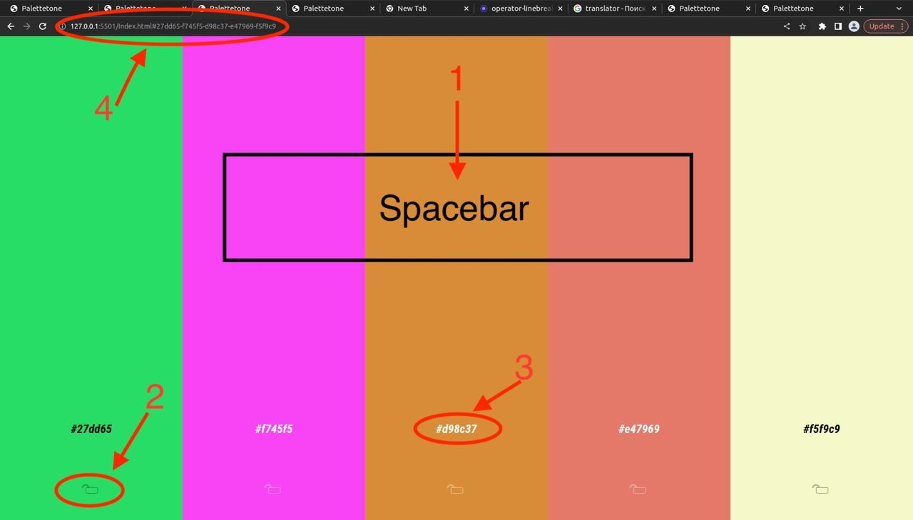

# Palettetone
Hi! This is our first joint project of Group No. 30. In this project, we have created a website for the selection of a color palette. 
## Site operation instructions

  1.To search for new colors, press the space bar;

  2.In order to fix the colors you like, click on the open lock icon;

  3.To copy a single color, click on the RGB code of this color;

  4.In order to share the finished palette with someone, copy the Url link to the clipboard;